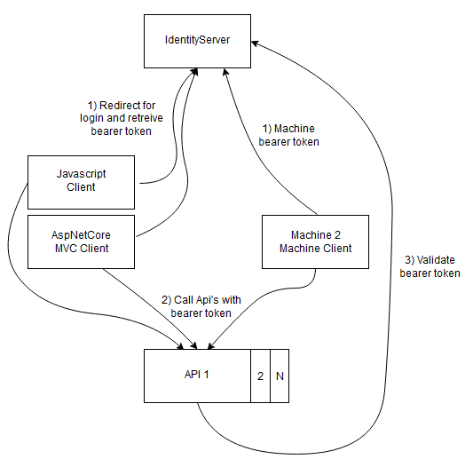
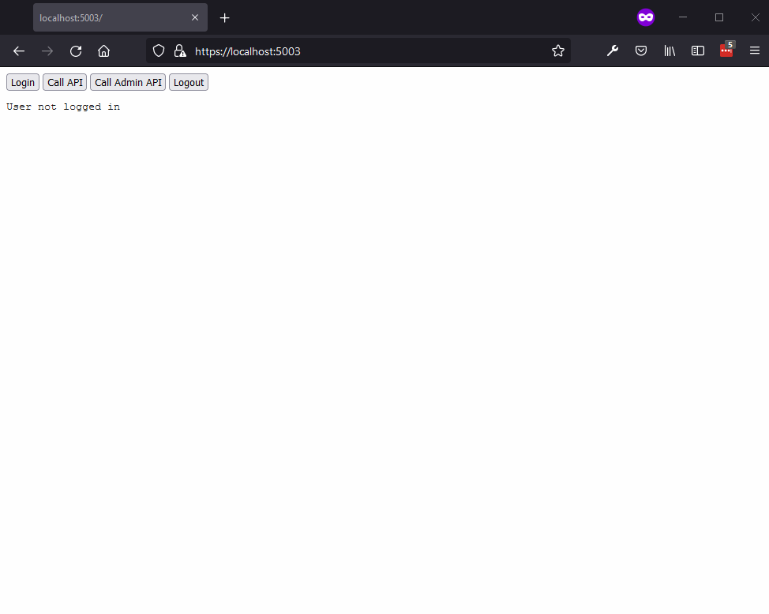
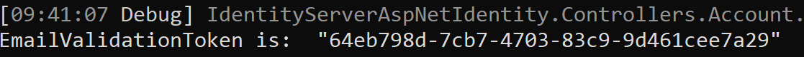

# Dotnet.IdentityServer

This project goal is to show a basic implementation of IdentityServer for a range of different scenarios.

In this repository you will find 4 Clients using the IdentityServers. AspNetCore MVC client, a Javascript client, a Blazor WASM client and a Console APP Client. All showing how you can check claims and show roles of the logged in user.

There is also included an API that points at IdentityServer as Authority. You could have any number of API's as microservice in your setup. They take the bearer token they receive from the calls and validate it against IdentityServer, that the user has access to whatever resource they are trying to get.

Below you can see gif showing login using the Javascript client. Redirecting to the first IdentityServer, where the user has 3 options to login. Username / Password, Google and External / secondary Identity server. The user uses External identity and get's redirected. Likewise would google login redirect to google login. When the user then login on the External identity server, the user would then be redicted back to the first identity server to verify the login and then redirect back to the javascript client as a logged in user. It should happen so fast, that it seems the user skips the first redirect and gets redirected instant back to the javascript client.

# Setup

To setup this project you need some localhost ssl certificates and a MS SQL or Postgres database. For the SSL certificates there is a powershell script to generate them: src/GenerateSslCerts.ps1

For the database, if you have docker and docker-compose installed, you can run the src\docker-compose.dependencies.yml for creating a database and running seeding / migrations scripts. Otherwise install your database of choice manually and run seeding / migrations scripts.

# Running

You have 2 options for running this project locally. Either run src\docker-compose.yml and try out the solution. If you want to develop and debug locally I would recommend running src\docker-compose.dependencies.yml for getting a database and seeding test data. IP / Ports can be seen below here: 

Ip/port:

* https://localhost:5001 IdenitityServer (Docker-compose and debug)
* https://localhost:5003 Javascript Client (Docker-compose and debug)
* https://localhost:5005 Dotnet MVC Project (Docker-compose and debug)
* http://localhost:5006 Blazor Client (Docker-compose)
* https://localhost:5007 Blazor Client (Debug)
* https://localhost:6002 API Project (Docker-compose and debug)

Default users:

username "alice" and "bob" with password: Pass123$

You can add Google authentication by creating your own google app account and inserting the secrets in the appsettings of identity project. Remember to setup the redirect urls in your google app. They are able to redirect to localhost etc. for local development.

For debug the project is using a fake email service. So if you want to create a new user, you will have to either check the database for EmailValidationToken on UserSignuoRequestsTable or check the console log output where it is written in Debug.

This is a work in progress project :) Handle with care. Alot of hardcoded IP's still in place to be fixed.

# Dotnet Migrations

## Init

For starting up and creating migrations from scratch if you choose to do so:

dotnet ef migrations add InitialIdentityServerPersistedGrantDbMigration -c PersistedGrantDbContext -o Data/Migrations/IdentityServer/PersistedGrantDb

dotnet ef migrations add InitialIdentityServerConfigurationDbMigration -c ConfigurationDbContext -o Data/Migrations/IdentityServer/ConfigurationDb

dotnet ef migrations add InitialIDbMigration -c ApplicationDbContext -o Data/Migrations/IdentityServer/ApplicationDb

dotnet ef database update --context ApplicationDbContext
dotnet ef database update --context PersistedGrantDbContext
dotnet ef database update --context ConfigurationDbContext

## Adding more tables to the Identity database

Within the Identity project run the following command to add new migrations. Otherwise, it is like working with EF Core as normally. I have choosen to use the ApplicationDBContext to add new tables. Mostly because this would enable me to make foreign key against the AspNetUser table. You could move logic to a new DB context and store it in a different database.

dotnet ef migrations add UserSignupRequest -c ApplicationDbContext -o Data/Migrations/IdentityServer/ApplicationDb

# Some links I found usefull while creating this project

https://docs.microsoft.com/en-us/aspnet/core/security/docker-compose-https?view=aspnetcore-5.0

https://docs.microsoft.com/en-us/aspnet/core/security/docker-https?view=aspnetcore-5.0

https://docs.docker.com/engine/examples/dotnetcore/

https://github.com/IdentityServer/IdentityServer4/tree/main/samples/Clients/src

https://expressdb.io/sql-server-express-feature-comparison.html#sql-server-edition-feature-comparison

https://hub.docker.com/_/microsoft-mssql-server

https://hub.docker.com/_/postgres

https://docs.docker.com/compose/aspnet-mssql-compose/

# Roadmap

I have created a github project, where you can keep updated about the progress and roadmap: https://github.com/users/TopSwagCode/projects/1

* Currently goal is to release version 1.0.0 of this project with basic user signup / login flow.
* Next version is planned to be focusing on Admin pages for user / role management.
* Sonarqube is also planned to be used for code analysis.
* Add build badges to the project.
* Add unit tests and upgrade quality of code.
* Trigger build
* Just do better

# Contributors

This project would love help! And there is plenty of stuff that needs help on getting done!

* Testing (Unit tests, Integration tests, Manuel tests)
* Documentation
* Refactoring / Clean code
* Adding new features
* Bug fixing

This project is by no mean perfect and getting to be part of the project shouldn't be too hard. There is one simple rule. THE BOY SCOUTS RULE: “Always leave the campground cleaner than you found it.” If you find a mess on the ground, you clean it up regardless of who might have made it. We don't need perfect Pull requests, but we shoulnd't leave the project in a worse state afterwards ;)